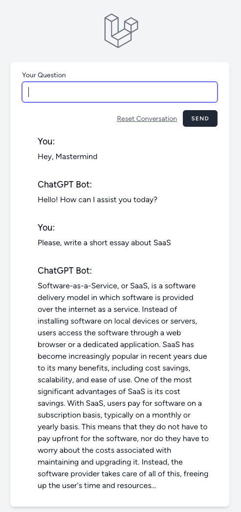

## About this project

The purpose of this demo is to showcase a very simple usage of the new [OpenAI Chat completions API](https://platform.openai.com/docs/guides/gpt/chat-completions-api) and the `gpt-3.5-turbo` model.

If you want to integrate ChatGPT on your company Website or mobile app and provide a Virtual Assistant (ChatGPT bot) to your employees, customers or partners, this is a quick and very simple example of how todo it.

Here is a look at the result:

### Software stack and setup

* Checkout this repo locally
* This is a Laravel 10 web application
  * Uses OpenAI PHP client (`openai-php/laravel`)
  * Make sure you have Docker Engine installed
* Generate your OpenAI API key and set it (`OPENAI_API_KEY=sk-...`) in the .env file of the project.
* cd into the project directory and start the container: `./vendor/bin/sail up -d`
* Open your browser and go to http://localhost
* Enjoy chatting with your Virtual Assistant ;)

---

## About Laravel

Laravel is a web application framework with expressive, elegant syntax. We believe development must be an enjoyable and creative experience to be truly fulfilling. Laravel takes the pain out of development by easing common tasks used in many web projects, such as:

- [Simple, fast routing engine](https://laravel.com/docs/routing).
- [Powerful dependency injection container](https://laravel.com/docs/container).
- Multiple back-ends for [session](https://laravel.com/docs/session) and [cache](https://laravel.com/docs/cache) storage.
- Expressive, intuitive [database ORM](https://laravel.com/docs/eloquent).
- Database agnostic [schema migrations](https://laravel.com/docs/migrations).
- [Robust background job processing](https://laravel.com/docs/queues).
- [Real-time event broadcasting](https://laravel.com/docs/broadcasting).

Laravel is accessible, powerful, and provides tools required for large, robust applications.

## License

The Laravel framework is open-sourced software licensed under the [MIT license](https://opensource.org/licenses/MIT).
